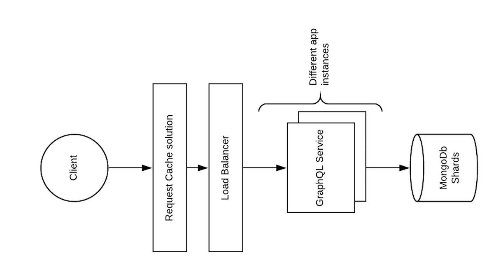

# Architecture

## Diagram

## Assumptions

### Big number of request

Captains are famous. We can expect a high number of requests for this API. Therefore, I would provide a caching solution. This will reduce stress on the application and will deliver data faster.

I would also add a load balancer so traffic can be redirected to different instances of the service.

### Ingesting data

Even the amount of requests to retrieve logs is reduced. It still can be expected to have a considerable amount of requests to ingest new logs. Therefore, is reasonable to expect to reach a number of requests superior to the ones the application can handle. For that reason, a load balancer should be put in front of the application and create different instances of it.

### Storing the data

The current system requires ingesting a potentially big amount of logs more than storing highly relational data. Therefore, a NoSQL database seems a good choice for this project. For data redundancy and availability, sharding can be considered.

### Retrieving big amounts of data

Retrieving logs from all places/captains can result in a big amount of data. For that reason, It would be necessary to paginate responses so the size of it can be controlled. The approach taken on this project is `cursor-based pagination` as explained on [GraphQL pagination documentation](https://graphql.org/learn/pagination/)
